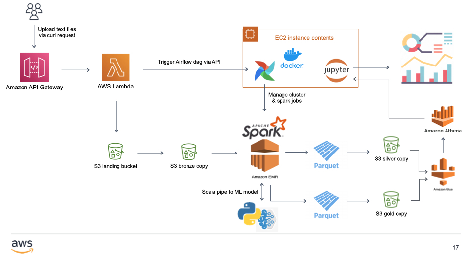

# Introduction
## Prosody
The goal of this project is to process literary text files for prosodic analysis. I used [Pincelate by Allison Parrish](https://github.com/aparrish/pincelate) alongside pronunciation phonemes available in cmudict to transform each text into its prosodic profile, a string of 0s (no stress), 1s (primary stress), and 2s (secondary stress). 
## Architecture

1. User uploads text files via API Gateway, which redirects the request to a lambda handler.
2. Lambda stores exact copies in the S3 landing bucket and extracted copies in the bronze bucket.
3. Lambda triggers Airflow dag via API.
4. Airflow creates EMR and submits a spark job.
5. Scala Spark engine pipes data to and from Pincelate, a Python machine learning model for guessing the pronunciation of a word.
6. Spark engine writes intermediary results to a silver copy, which contains clean text and full prosodic sequence. Spark engine outputs a gold copy, which contains the prosodic profiles of each text.
7. S3 Trigger triggers a Glue crawler, which makes data in the silver and gold buckets available in Athena.
8. A dashboarding tool can access the tables in Athena for analysis. An example Jupyter notebook is included in this repository.

# Files
- Scala project structure contains the files necessary for compiling a spark jar.
- run_spark_job.py is the Airflow dag.
- stressDict.parquet contains the reference table of words and their corresponding stress patterns.
- soundout.py is the Python script for using Pincelate.
- pincelate.sh is the script for bootstrapping EMR worker nodes.
- lambda.py contains the lambda function that the API Gateway invokes.
- Prosody Example.ipynb is the example Jupyter notebook.

# CI/CD
The spark engine jar file is compiled and copied to the appropriate s3 path through GitHub Actions.

# Notes
- The spark engine can be easily extended to handle other input formats, e.g., html (literature published online).
- The silver copy can be used to do ad-hoc analysis on the full prosodic string.
- The gold copy contains percentages of iambs, dactyls, anapests, trochees, and spondees, normalized by the length of the text.
- The example Jupyter notebook contains multidimensional scaling of a few texts based on their prosodic profiles.
- The stress dictionary (stressDict.parquet) is expanded each time a text is uploaded. The words that are not found in the stress dictionary are piped to Pincelate, then added to the dictionary, so that they're readily available in the future.
